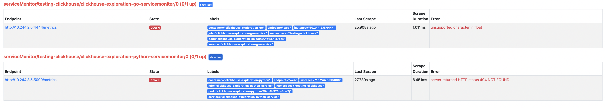

# GitLab AI Assist

This project is based on the open source project
[FauxPilot](https://github.com/moyix/fauxpilot/blob/main/docker-compose.yaml) as an initial iteration in an effort to
create a GitLab owned AI Assistant to help developers write secure code by the
[AI Assist SEG](https://about.gitlab.com/handbook/engineering/incubation/ai-assist/).

## API

### Authentication

The Code Suggestions API supports authentication via Code Suggestions access tokens.

You can use an Code Suggestions access token to authenticate with the API by passing it in the
`Authorization` header and specifying the `X-Gitlab-Authentication-Type` header.

```shell
curl --header "Authorization: Bearer <access_token>" --header "X-Gitlab-Authentication-Type: oidc" \
  "https://codesuggestions.gitlab.com/v2/completions"
```

### Completions

Given a prompt, the service will return one or more predicted completions.

```plaintext
POST v2/completions
```

| Attribute                           | Type   | Required | Description                                                        | Example                   |
| ----------------------------------- | ------ | -------- | ------------------------------------------------------------------ | ------------------------- |
| `prompt_version`                    | int    | no       | The version of the prompt                                          | `1`                       |
| `project_path`                      | string | no       | The name of the project (max_len: **255**)                         | `gitlab-orb/gitlab-shell` |
| `project_id`                        | int    | no       | The id of the project                                              | `33191677`                |
| `current_file`                      | hash   | yes      | The data of the current file                                       |                           |
| `current_file.file_name`            | string | yes      | The name of the current file (max_len: **255**)                    | `README.md`               |
| `current_file.content_above_cursor` | string | yes      | The content above cursor (max_len: **100,000**)                    | `import numpy as np`      |
| `current_file.content_below_cursor` | string | yes      | The content below cursor (max_len: **100,000**)                    | `def __main__:\n`         |
| `telemetry`                         | array  | no       | The list of telemetry data from previous request (max_len: **10**) |                           |
| `telemetry.model_engine`            | string | no       | The model engine used for completions (max_len: **100,000**)       | `vertex-ai`               |
| `telemetry.model_name`              | string | no       | The model name used for completions (max_len: **50**)              | `code-gecko`              |
| `telemetry.lang`                    | string | no       | The language used for completions (max_len: **50**)                | `python`                  |
| `telemetry.experiments`             | array  | no       | The list of experiments run from previous request                  |                           |
| `telemetry.experiments.name`        | string | yes      | The experiment name                                                | `exp_truncate_suffix`     |
| `telemetry.experiments.variant`     | int    | yes      | The experiment variant                                             | `0`                       |
| `telemetry.requests`                | int    | yes      | The number of previously requested completions                     | `1`                       |
| `telemetry.accepts`                 | int    | yes      | The number of previously accepted completions                      | `1`                       |
| `telemetry.errors`                  | int    | yes      | The number of previously failed completions                        | `0`                       |

```shell
curl --request POST \
  --url 'https://codesuggestions.gitlab.com/v2/completions' \
  --header 'Authorization: Bearer <access_token>' \
  --header 'X-Gitlab-Authentication-Type: oidc' \
  --header 'Content-Type: application/json' \
  --data-raw '{
    "prompt_version": 1,
    "project_path": "gitlab-org/gitlab-shell",
    "project_id": 33191677,
    "current_file": {
      "file_name": "test.py",
      "content_above_cursor": "def is_even(n: int) ->",
      "content_below_cursor": ""
    }
    "telemetry": [
      {
        "model_engine": "vertex-ai",
        "model_name": "code-gecko",
        "lang": "python",
        "experiments": [
          {
            "name": "exp_truncate_suffix",
            "variant": 0
          }
        ],
        "requests": 1,
        "accepts": 1,
        "errors": 0
      }
    ]
  }'
```

```json
{
  "id": "id",
  "model": {
    "engine": "vertex-ai",
    "name": "code-gecko",
    "lang": "python"
  },
  "experiments": [
    {
      "name": "exp_truncate_suffix",
      "variant": 0
    }
  ]
  "object": "text_completion",
  "created": 1682031100,
  "choices": [
    {
      "text": " bool:\n    return n % 2 == 0\n\n\ndef is_odd",
      "index": 0,
      "finish_reason": "length"
    }
  ]
}
```

#### Responses

- `200: OK` if the service returns some completions.
- `422: Unprocessable Entity` if the required attributes are missing.
- `401: Unauthorized` if the service fails to authenticate using the access token.

## Prerequisites

You'll need:

- Docker
- `docker compose` >= 1.28
- An NVIDIA GPU with Compute Capability >= 6.0 and enough VRAM to run the model you want.
- [`nvidia-docker`](https://github.com/NVIDIA/nvidia-docker)
- `curl` and `zstd` for downloading and unpacking the models.

If you're working locally, you'll also need other tools to build a
[`tree-sitter`](https://tree-sitter.github.io/tree-sitter/) library:

- gcc
- nodejs (needed for TypeScript grammar)

Note that the VRAM requirements listed by `setup.sh` are _total_ -- if you have multiple GPUs, you can split the model
across them. So, if you have two NVIDIA RTX 3080 GPUs, you _should_ be able to run the 6B model by putting half on each
GPU.

## Developing

Before submitting merge requests, run lints and tests with the following commands
from the root of the repository.

```shell
# Lint python files
make lint

# Run tests
make test
```

There is an [internal recording](https://youtu.be/SXfLOYm4zS4) for GitLab members that provides an overview of this project.

### Frameworks

This project is built with the following frameworks:

1. [FastAPI](https://fastapi.tiangolo.com/)
1. [Dependency Injector](https://python-dependency-injector.ets-labs.org/introduction/di_in_python.html)

### Project architecture

This repository follows [The Clean Architecture](https://blog.cleancoder.com/uncle-bob/2012/08/13/the-clean-architecture.html) paradigm,
which define layers present in the system as well as their relations with each other, please refer to the linked article for more details.

### Project structure

This project was from [FauxPilot](https://github.com/moyix/fauxpilot/blob/main/docker-compose.yaml) as a base, however, due to the business
direction change GitLab for a time being decided to not train models on its own. With that significant part of this repository became
deprecated and is no longer in active use, including:

1. All code in `/models` directory
1. All code in `/converter` directory

For the Code Suggestion feature most of the code is hosted at `/codesuggestions`. In that directory following artifacts can be of interest:

1. `app.py` - main entry point for web application
1. `suggestions/engine.py` - that contains `ModelEnginePalm` that is responsible for high-level orchestration of prompt transformation for external models
1. `api/v2/endpoints/code.py` - that houses implementation of main production Code Suggestion API
1. `api/v2/experimental/code.py` - implements experimental endpoints that route requests to fixed external models for experimentation and testing

This project utilizes middleware to provide additional mechanisms that are not strictly feature-related including authorization and logging.
Middlewares are hosted at `codesuggestions/api/middleware.py` and interact with the `context` global variable that represents the API request.

## Configuration

Below described the configuration per component

### API

All parameters for the API are available from `api/config/config.py` which heavily relies on environment variables. An
overview of all environment variables used and their default value, if you want to deviate you should make them
available in a `.env`:

```dotenv
API_EXTERNAL_PORT=5001  # External port for the API used in docker-compose
METRICS_EXTERNAL_PORT=8082  # External port for the /metrics endpoint used in docker-compose
F_IS_THIRD_PARTY_AI_DEFAULT=true
F_THIRD_PARTY_ROLLOUT_PERCENTAGE=100
PALM_TEXT_MODEL_NAME=code-gecko
PALM_TEXT_PROJECT=unreview-poc-390200e5
FASTAPI_API_HOST=0.0.0.0
FASTAPI_API_PORT=5000
FASTAPI_METRICS_HOST=0.0.0.0
FASTAPI_METRICS_PORT=8082
# FASTAPI_DOCS_URL=None  # To disable docs on the API endpoint
# FASTAPI_OPENAPI_URL=None  # To disable docs on the API endpoint
# FASTAPI_REDOC_URL=None  # To disable docs on the API endpoint
AUTH_BYPASS_EXTERNAL=False  # Can be used for local development to bypass the GitLab server side check
GITLAB_URL=https://gitlab.com/  # Can be changed to GDK: http://127.0.0.1:3000/
GITLAB_API_URL=https://gitlab.com/api/v4/  # Can be changed to GDK: http://127.0.0.1:3000/api/v4/
USE_LOCAL_CACHE=True  # Uses a local in-memory cache instead of Redis
```

Note that the `FASTAPI_xxx_URL` values must either be commented out or
prefaced with a valid route that begins with `/`. `python-dotenv` will
treat any value as a string, so specifying `None` maps to the Python
value `'None'`.

## How to run the server locally

1. Create virtualenv and init shell: `poetry shell`
1. Install dependencies: `poetry install`
1. Copy the `example.env` file to `.env`: `cp example.env .env`
1. Update the `.env` file in the root folder with the following variables:

   ```
   AUTH_BYPASS_EXTERNAL=true
   F_IS_THIRD_PARTY_AI_DEFAULT=true
   F_THIRD_PARTY_ROLLOUT_PERCENTAGE=100
   PALM_TEXT_MODEL_NAME=code-gecko
   PALM_TEXT_PROJECT=unreview-poc-390200e5
   FASTAPI_DOCS_URL=/docs
   FASTAPI_OPENAPI_URL=/openapi.json
   FASTAPI_API_PORT=5052
   ```

1. Start the model-gateway server locally: `poetry run codesuggestions`
1. Open `http://0.0.0.0:5052/docs` in your browser and run any requests to the codegen model

### Faking out AI models

If you do not require real models to run and evaluate inputs, you can fake out these dependencies
by setting the `USE_FAKE_MODELS` environment variable. This will return a canned response for
code suggestions, while allowing you to run an otherwise fully functional model gateway.

This can be useful for testing middleware, request/response interface contracts, logging, and other
uses cases that do not require an AI model to execute.

## Local development using GDK

You can either run `make develop-local` or `docker-compose -f docker-compose.dev.yaml up --build --remove-orphans` this
will run the API. If you need to change configuration for a Docker Compose service, add it to `docker-compose.override.yaml`.
Any changes made to services in this file will be merged into the default settings.

Next open the VS Code extension project, and run the development version of the GitLab Workflow extension locally.

In VS Code code need to set the const `AI_ASSISTED_CODE_SUGGESTIONS_API_URL` constant to `http://localhost:5000/completions`.

Since the feature is only for SaaS, you need to run GDK in SaaS mode:

```bash
export GITLAB_SIMULATE_SAAS=1
gdk restart
```

Then go to `admin/settings/general/account_and_limit` and enable `Allow use of licensed EE features`.

You also need to make sure that the group you are allowing, is actually `ultimate` as it's an `ultimate` only feature,
go to `admin/overview/groups` select `edit` on the group, set `plan` to `ultimate`.

In GDK you need to enable the feature flags:

```ruby
rails console

g = Group.find(22)  # id of your root group
Feature.enable(:ai_assist_api)
Feature.enable(:ai_assist_flag, g)
```

This will allow the feature to actually return `{"user_is_allowed": true }`.

## Authentication

The intended use of this API is to be called from the
[GitLab VS code extension](https://gitlab.com/gitlab-org/gitlab-vscode-extension), the extension authenticates users
against the GitLab Rails API. However, we can not rely on the VS Extension to authorize users for AI Assist as it runs
on the client side, we need a server side check. So in order to do that, the extension passes along the user's token via
a header to the AI Assist API, this token is subsequently used to make a `GET` call to `/v4/ml/ai-assist` on behalf of
the user to verify that it can indeed use AI Assist. The response `{"user_is_allowed": bool}` will be cached for 1 hour
to not burden the Rails API with an excessive amount of calls.

Below diagram described the authentication flow in blue.


## Component overview

In above diagram the main components are shown.

### VS Code extension

The VS Code extension has the following functions:

1. Determine input parameters
   1. Stop sequences
   1. Gather code for the prompt
1. Send the input parameters to the AI Assist API using the OpenAI package
1. Parse results from AI Assist and present them as `inlineCompletions`

### AI Assist API

Is written in Python and uses the FastApi framework along with Uvicorn. It has the following functions

1. Provide a REST API for incoming calls on `/v2/completions`
1. Authenticate incoming requests against GitLab `/v4/ml/ai-assist` and cache the result
1. Convert the prompt into a format that can be used by GCP Vertex AI
1. Call Vertex AI, await the result and parse it back as a response

### GitLab API

The endpoint `/v4/ml/ai-assist` checks if a user meets the requirements to use AI Assist and returns a boolean.

## Deployment to Runway

Code suggestions is continuously deployed to [Runway](https://about.gitlab.com/handbook/engineering/infrastructure/platforms/tools/runway/).

This deployment is not yet serving production traffic from `codesuggestions.gitlab.com`, but the aim is to shift this soon ([&1064](https://gitlab.com/groups/gitlab-com/gl-infra/-/epics/1064)). Once this is complete and we are confident in the stability, we can deprecate the legacy Kubernetes-based deployment.

When an MR gets merged, CI will build a new Docker image, and trigger a Runway downstream pipeline that will deploy this image to staging, and then production. Downstream pipelines run against the [deployment project](https://gitlab.com/gitlab-com/gl-infra/platform/runway/deployments/ai-gateway).

The deployment is available at:

- `https://ai-gateway.staging.runway.gitlab.net` (staging)
- `https://ai-gateway.runway.gitlab.net` (production)

The service overview dashboard is available at [https://dashboards.gitlab.net/d/ai-gateway-main/ai-gateway-overview](https://dashboards.gitlab.net/d/ai-gateway-main/ai-gateway-overview).

For more information and assistance, please check out:

- [Runway - Handbook](https://about.gitlab.com/handbook/engineering/infrastructure/platforms/tools/runway/)
- [Runway - Group](https://gitlab.com/gitlab-com/gl-infra/platform/runway)
- [Runway - Docs](https://gitlab.com/gitlab-com/gl-infra/platform/runway/docs)
- [Runway - Issue Tracker](https://gitlab.com/groups/gitlab-com/gl-infra/platform/runway/-/issues)
- `#f_runway` in Slack.

## Deploying to the Kubernetes cluster (legacy)

Below, we give a guideline tested specifically on the GKE cluster in the Applied ML group. Successful work
on any other clusters is not guaranteed.

1. Enable the following APIs in the Google Cloud Project:

   ```shell
   # Enable Cloud Profiler for Continuous Profiling
   gcloud services enable cloudprofiler.googleapis.com
   ```

1. Create a GKE cluster with the following configuration:

   - gke version `1.24.5-gke.600`
   - image type `container-optimized OS with containerd.`
   - machine type `n1-standard-2` machines,
   - autoscaling enabled `from 0 to 5` nodes

1. Install [`cert-manager`](https://cert-manager.io/docs/):

   ```shell
   kubectl create namespace cert-manager
   kubectl config set-context --current --namespace cert-manager
   kubectl apply -f https://github.com/cert-manager/cert-manager/releases/download/v1.10.0/cert-manager.yaml
   kubectl apply -f ./manifests/cert-manager/cluster-issuer.yaml
   ```

1. Install the Ingress [`NGINX`](https://kubernetes.github.io/ingress-nginx/) controller:

   ```shell
   kubectl create namespace nginx
   kubectl config set-context --current --namespace nginx
   helm repo add ingress-nginx https://kubernetes.github.io/ingress-nginx && helm repo update
   helm install nginx ingress-nginx/ingress-nginx --set controller.config.use-forwarded-headers=true
   ```

1. To enable monitoring on ingress-nginx:

   ```shell
   helm upgrade nginx ingress-nginx/ingress-nginx \
     --namespace nginx \
     --set controller.metrics.enabled=true \
     --set controller.metrics.serviceMonitor.enabled=true \
     --set controller.metrics.serviceMonitor.additionalLabels.release="prometheus" \
     --set controller.extraArgs.time-buckets="0.5\,1\,2.5\,5\,10\,30\,60"
   ```

1. Create the `ai-assist` namespace and update the current context

   ```shell
   export KUBERNETES_AI_ASSIST_NAMESPACE=ai-assist
   kubectl create namespace $KUBERNETES_AI_ASSIST_NAMESPACE
   kubectl config set-context --current --namespace $KUBERNETES_AI_ASSIST_NAMESPACE
   ```

1. Create the `docker-registry` secret to pull private images from GitLab AI Assist registry:

   ```shell
   export DEPLOY_TOKEN_USERNAME=<USERNAME>
   export DEPLOY_TOKEN_PASSWORD=<PASSWORD>
   kubectl create secret docker-registry gitlab-registry \
      --docker-server="registry.gitlab.com" \
      --docker-username="$DEPLOY_TOKEN_USERNAME" \
      --docker-password="$DEPLOY_TOKEN_PASSWORD"
   ```

1. (Optional) In case of testing a redirect to a third-party AI service, create a file with the required project
   identifiers and deploy it as a secret:

   ```shell
   # each line contains one project in the format: <project_id>,<project_full_name>
   # E.g.:
   # 250833,gitlab-org/gitlab-runner
   # 13284652,gitlab-org/git
   export THIRD_PARTY_AI_LIMITED_ACCESS=<path to the file>
   kubectl create secret generic third-party-ai-limited-access \
      --from-file=list.txt="${THIRD_PARTY_AI_LIMITED_ACCESS}"
   ```

1. Install the `helm-diff` plugin:

   ```shell
   helm plugin install https://github.com/databus23/helm-diff
   ```

1. Install chart dependencies

   ```shell
   helm dep build infrastructure/ai-assist
   ```

1. Deploy the `ai-assist` helm chart:

   ```shell
   cd infrastructure

   # For Staging
   scripts/deploy diff gstg
   scripts/deploy sync gstg
   scripts/deploy sync gstg --no-dry-run

   # For Production...
   scripts/deploy diff gprd
   scripts/deploy sync gprd
   scripts/deploy sync gprd --no-dry-run
   ```

1. Deploy a new version of the Model-Gateway using the `ai-assist` helm chart. Note that this should normally be done via the CI job.

   ```shell
   cd infrastructure
   # Deploy the Model-Gateway container with tag `deadbeef`...
   scripts/deploy sync gprd --no-dry-run --deploy model-gateway=deadbeef
   ```

1. Deploy the NGINX ingress resource with TLS enabled:

   ```shell
   kubectl apply -f ./manifests/ingress/ingress-nginx.yaml
   ```

### Deploying the Application from CI/CD

Deployments can be controlled via manual CI/CD jobs running in pipelines on [ops.gitlab.net](https://ops.gitlab.net/gitlab-org/modelops/applied-ml/code-suggestions/ai-assist).

#### How to deploy a new version to staging

1. Looking at the pipeline on gitlab.com, ensure that the new registry image has been built and pushed to registry.gitlab.com
1. Look for the Woodhouse notification for the pipeline running on ops.gitlab.net, and navigate to the pipeline.
1. You will find a manual job, `helm-deploy-gstg: [model-gateway]` for deploying the Model Gateway.
1. Click the "play" button to deploy the new CI image to the [`ai-assist-test`](https://console.cloud.google.com/kubernetes/clusters/details/us-central1-c/ai-assist-test/nodes?project=unreview-poc-390200e5) Cluster.
1. The job will complete when the deployment completes.

#### How to deploy a new version to production

1. Merge your merge request and ensure that the pipeline on the `main` branch completes successfully.
1. Ensure that the new registry image has been built and pushed to registry.gitlab.com
1. Visit <https://ops.gitlab.net/gitlab-org/modelops/applied-ml/code-suggestions/ai-assist/-/pipelines> and navigate to the latest `main` branch pipeline.
1. You will find a manual job, `helm-deploy-gprd: [model-gateway]` for deploying the Model Gateway.
1. Click the "play" button to deploy the new CI image to the [`ai-assist` Cluster](https://console.cloud.google.com/kubernetes/clusters/details/us-central1-c/ai-assist/details?project=unreview-poc-390200e5).
1. The job will complete when the deployment completes.

## Monitoring

The following monitoring and observability resources are available:

1. [`code_suggestions` Service Overview Dashboard in Grafana](https://dashboards.gitlab.net/d/code_suggestions-main/code-suggestions-overview?orgId=1)
1. [Model Gateway Continuous Profiling](https://console.cloud.google.com/profiler/model-gateway;type=CPU/cpu?referrer=search&project=unreview-poc-390200e5)
1. [Code Suggestions Kibana Dashboard](https://log.gprd.gitlab.net/goto/b34327f0-feb2-11ed-8afc-c9851e4645c0)

### Prerequisites

You will need `kubectl` installed on your computer and a modicum of comfort with the command line. Following that, you will need to configure a context to connect to the cluster from which you wish to deploy, access, or remove the monitoring stack.

Additionally you will also need to have the latest version of helm and make installed.

Other useful tools:

1. [kubectx](https://github.com/ahmetb/kubectx): For managing multiple Kubenetes contextes.
1. [k9s](https://github.com/derailed/k9s): A nice interface for managing and navigating a Kubernetes cluster.

### Connect to the Kubernetes cluster

1. Log into the [Google Cloud console](https://console.cloud.google.com).
1. In the Search prompt, enter `Kubernetes clusters`.
1. Navigate to the cluster (for example: `ai-assist`) to which you want to connect.
1. Click on `Connect`. You should see a command in the form:

   ```shell
   gcloud container clusters get-credentials ai-assist --zone us-central1-c --project unreview-poc-390200e5
   ```

1. Run that command on your terminal. This will set the current Kubernetes context to that cluster.
1. For the `ai-assist` cluster, add your local IP to the `Control plane authorized networks`. This restricts `kubectl` access
   for specific IP addresses.

### Deploying Monitoring

NOTE: This is only necessary for installing monitoring on a new cluster. This is not necessary for accessing a production environment.

Deploying monitoring to your kubernetes cluster is rather straightforward. While connected to the cluster run the following make commands.

```shell
make monitoring-setup # This only needs to be run once
make monitoring-deploy
```

### Connecting to Grafana and Prometheus UI

Firstly let's check our context and then switch to the correct context as needed.

```shell
# Checking your context
kubectl config current-context

# Finding available contexts
kubectl config get-contexts

# Switching contexts
kubectl config use-context {{CONTEXT_NAME_HERE}}
```

#### Grafana Port Forward

Grafana is where all the dashboard of the metrics can be found. Now that we are in the correct context you can port-forward the grafana service to your local machine with the following command.

```shell
# Mapping port 80 on the service to localhost:3000
kubectl -n monitoring port-forward service/prometheus-grafana 3000:80
```

#### Prometheus UI Port Forward

Occasionally it is useful to check which targets are being scraped by Prometheus and if they are actually receiving metrics. The following command will execute a port forward to your desired Prometheus instance, assuming you are in the correct context. You are in the correct context, right?

```shell
# Mapping port 9090 on the service to localhost:9090
kubectl -n monitoring port-forward service/prometheus-kube-prometheus-prometheus 9090:9090
```

#### Service Discovery

Once port forwarding is set up, Service Discovery is useful to determine if Prometheus can even see the ServiceMonitor you have deployed. If your ServiceMonitor does not appear after 60 seconds then it is likely to be misconfigured.

The most common things to forget when configuring a Service and ServiceMonitor are as follows:

- The label `release: prometheus` in the ServiceMonitor
- The name of the port which should be specified in the Service as well as in the ServiceMonitor (`port: web` in the ServiceMonitor and `name:web` in the Service in the below example
- The selector that should be set in `metadata.labels` in the Service and in `spec.selector.matchLabels` in the ServiceMonitor (`app: clickhouse-exploration-go` in the below example) .

```yaml
apiVersion: monitoring.coreos.com/v1
kind: ServiceMonitor
metadata:
  name: clickhouse-exploration-go-servicemonitor
  labels:
    release: prometheus
spec:
  endpoints:
    - interval: 30s
      port: web
  selector:
    matchLabels:
      app: clickhouse-exploration-go
---
apiVersion: v1
kind: Service
metadata:
  name: clickhouse-exploration-go-service
  labels:
    app: clickhouse-exploration-go
spec:
  selector:
    app: clickhouse-exploration-go
  ports:
    - protocol: "TCP"
      name: web
      port: 4444
      targetPort: 4444
  type: LoadBalancer
```

Service Discovery only tells you if Prometheus can see the ServiceMonitor, in order to determine if the metrics can be pulled from the service you need to check the targets page.

#### Targets

Once port forwarding is setup, Targets can be found under the Status tab or one can simply go to this endpoint: <http://localhost:9090/targets?search>=

Targets are useful for debugging. Below are examples of two ServiceMonitors, connecting to a golang and python service respectively, that are not configured for scraping and do not expose a `/metrics` endpoint.


