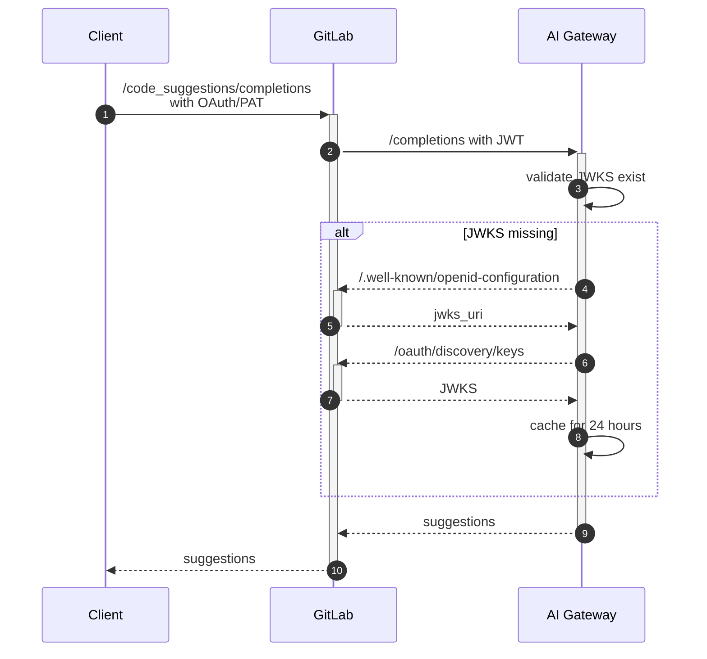

# GitLab AI Gateway

GitLab AI Gateway is a standalone-service that will give access to AI features to all users of
GitLab, no matter which instance they are using: self-managed, dedicated or GitLab.com.

## API

See [API](docs/api.md).

## Prerequisites

You'll need:

- Docker
- `docker compose` >= 1.28
- [`gcloud` CLI](https://cloud.google.com/docs/authentication/provide-credentials-adc#how-to)

### Google Cloud SDK

Set up a Google Cloud project with access to the Vertex AI API and authenticate to it locally by following [these instructions](https://docs.gitlab.com/ee/development/ai_features/#gcp-vertex).

## Testing

This project uses [Pytest](https://docs.pytest.org/en/stable/) for testing.
To run the entire test suite, you can use the following command:

```shell
make test
```

To run the tests in watch mode, use the following command:

```shell
make test-watch
```

To see test coverage, you can run the following command:

```shell
make test-coverage
```

This will run all the tests, output coverage in the terminal and generate an HTML report.
You can view the HTML report by running:

```shell
open htmlcov/index.html
```

## Linting

This project uses the following linting tools:

- [Black](https://black.readthedocs.io/): Enforces a consistent code style.
- [isort](https://pycqa.github.io/isort/): Organizes and sorts imports.
- [pylint](https://pylint.pycqa.org): Analyzes code for potential errors and style issues.
- [mypy](https://mypy-lang.org): Performs static type checking.

To lint the entire projects, you can use the following command:

```shell
make lint
```

We are incrementally rolling out `mypy` static type checker to the project
([issue](https://gitlab.com/gitlab-org/modelops/applied-ml/code-suggestions/ai-assist/-/issues/246)).
To show outstanding `mypy` warnings, you can use the following command:

```shell
make check-mypy TODO=true
```

To fix linting errors, you can use the following command:

```shell
make format
```

The `format` command only addresses `black` and `isort` issues.

There is an [internal recording](https://youtu.be/SXfLOYm4zS4) for GitLab members that provides an overview of this project.

### Frameworks

This project is built with the following frameworks:

1. [FastAPI](https://fastapi.tiangolo.com/)
1. [Dependency Injector](https://python-dependency-injector.ets-labs.org/introduction/di_in_python.html)

### Project architecture

This repository follows [The Clean Architecture](https://blog.cleancoder.com/uncle-bob/2012/08/13/the-clean-architecture.html) paradigm,
which define layers present in the system as well as their relations with each other, please refer to the linked article for more details.

### Project structure

For the Code Suggestions feature, most of the code is hosted at `/ai_gateway`.
In that directory, the following artifacts can be of interest:

1. `app.py` - main entry point for web application
1. `code_suggestions/processing/base.py` - that contains base classes for ModelEngine.
1. `code_suggestions/processing/completions.py` and `suggestions/processing/generations.py` - contains `ModelEngineCompletions` and `ModelEngineGenerations` classes respectively.
1. `api/v2/endpoints/code.py` - that houses implementation of main production Code Suggestions API
1. `api/v2/experimental/code.py` - implements experimental endpoints that route requests to fixed external models for experimentation and testing

This project utilizes middleware to provide additional mechanisms that are not strictly feature-related including authorization and logging.
Middlewares are hosted at `ai_gateway/api/middleware.py` and interact with the `context` global variable that represents the API request.

## Configuration

Below described the configuration per component

### API

All parameters for the API are available from `api/config/config.py` which heavily relies on environment
variables. All supported environment variables with default values for development are specified in
`example.env`.

`python-dotenv` will treat any value as a string, so specifying `None` maps to the Python value `'None'`.

## How to run the server locally

1. Clone project and change to project directory.
1. Run `mise install` (recommended) or `asdf install`.
   - To install `mise`, see [instruction](https://mise.jdx.dev/getting-started.html).
1. Init shell: `poetry shell`.
1. [Activate virtualenv](#how-to-manually-activate-the-virtualenv).
1. Install dependencies: `poetry install`.
1. Copy the `example.env` file to `.env`: `cp example.env .env`
1. Update the `.env` file in the root folder with the following variables:

   ```shell
   ANTHROPIC_API_KEY=<API_KEY>
   ```

1. You can enable hot reload by setting the `AIGW_FASTAPI__RELOAD` environment variable to `true` in the `.env` file.
1. Ensure you're authenticated with the `gcloud` CLI by running `gcloud auth application-default login`.
1. Start the model-gateway server locally: `poetry run ai_gateway`.
1. Open `http://localhost:5052/docs` in your browser and run any requests to the model.

### Troubleshooting

If `gcloud` setup fails with `ModuleNotFoundError: No module named 'imp'`, during `asdf install` run:

```sh
export CLOUDSDK_PYTHON=$(which python3.11)
```

Then, try again. For more details, refer to [this StackOverflow post](https://stackoverflow.com/questions/77316716/gcloud-modulenotfounderror-no-module-named-imp).

### Mocking AI model responses

If you do not require real models to run and evaluate the input data, you can mock the model responses
by setting the environment variable `AIGW_MOCK_MODEL_RESPONSES=true`.
The models will start echoing the given prompts, while allowing you to run a fully functional AI gateway.

This can be useful for testing middleware, request/response interface contracts, logging, and other
uses cases that do not require an AI model to execute.

### Logging requests and responses during development

AI Gateway workflow includes additional pre and post-processing steps. By default, the log level is `INFO` and
application writes log to `stdout`. If you want to log data between different steps for development purposes
and to a file, please update the `.env` file by setting the following variables:

```shell
AIGW_LOGGING__LEVEL=debug
AIGW_LOGGING__TO_FILE=../modelgateway_debug.log
```

### Set OIDC providers

When `AIGW_AUTH__BYPASS_EXTERNAL` is true, OIDC provider discovery is skipped.

To test OIDC, set the following in `.env`:

```shell
AIGW_AUTH__BYPASS_EXTERNAL=false

# To test GitLab SaaS instance as OIDC provider
AIGW_GITLAB_URL=http://127.0.0.1:3000/
AIGW_GITLAB_API_URL=http://127.0.0.1:3000/api/v4/

# To test CustomersDot as OIDC provider
AIGW_CUSTOMER_PORTAL_URL=http://127.0.0.1:5000
```

### How to manually activate the virtualenv

- `poetry shell` or `poetry install` should create the virtualenv environment.
- To activate virtualenv, use command: `. ./.venv/bin/activate`.
- To deactivate your virtualenv, use command: `deactivate`.
- To list virtualenvs, use `poetry env list`.
- To remove virtualenv, use `poetry env remove [name of virtualenv]`.

## Local development using GDK

### Prerequisites

Make sure you have credentials for a Google Cloud project (with the Vertex API enabled) located at `~/.config/gcloud/application_default_credentials.json`.
This should happen automatically when you run `gcloud auth application-default login`. If for any reason this JSON file is at a
different path, you will need to override the `volumes` configuration by creating or updating a `docker-compose.override.yaml` file.

### Running the API

You can either run `make develop-local` or `docker-compose -f docker-compose.dev.yaml up --build --remove-orphans`.
If you need to change configuration for a Docker Compose service, you can add it to `docker-compose.override.yaml`.
Any changes made to services in this file will be merged into the default settings.

Next open the VS Code extension project, and run the development version of the GitLab Workflow extension locally. See [Configuring Development Environment](https://gitlab.com/gitlab-org/gitlab-vscode-extension/-/blob/main/CONTRIBUTING.md#configuring-development-environment) for more information.

In VS Code code, we need to set the `MODEL_GATEWAY_AI_ASSISTED_CODE_SUGGESTIONS_API_URL` constant to `http://localhost:5000/completions`.

Since the feature is only for SaaS, you need to run GDK in SaaS mode:

```bash
export GITLAB_SIMULATE_SAAS=1
gdk restart
```

Then go to `/admin/application_settings/general`, expand `Account and limit`, and enable `Allow use of licensed EE features`.

You also need to make sure that the group you are allowing, is actually `ultimate` as it's an `ultimate` only feature,
go to `/admin/groups` select `Edit` on the group you are using, set `Plan` to `Ultimate`.

## Authentication

The intended use of this API is to be called from a client such as the
[GitLab VS Code Extension](https://gitlab.com/gitlab-org/gitlab-vscode-extension)
and other language servers. The client authenticates users against the GitLab
API using their OAuth or Personal Access Tokens (PAT). Once GitLab successfully
authenticates the request, it generates a JSON Web Token (JWT) and forwards the
code suggestions request to this Gateway.

The following diagram describes the authentication flow.



## Component overview

In above diagram, the main components are shown.

### Client

The Client has the following functions:

1. Determine input parameters
   1. Stop sequences
   1. Gather code for the prompt
1. Send the input parameters to the AI Gateway API.
1. Parse results from AI Gateway and present them as `inlineCompletions`.

We are supporting the following clients:

- [GitLab VS Code Extension](https://gitlab.com/gitlab-org/gitlab-vscode-extension)
- [GitLab Language Server for Code Suggestions](https://gitlab.com/gitlab-org/editor-extensions/gitlab-language-server-for-code-suggestions)

### AI Gateway API

Is written in Python and uses the [FastAPI](https://fastapi.tiangolo.com) framework
along with Uvicorn. It has the following functions:

1. Provide a REST API for incoming calls such as `/completions`.
1. Authenticate incoming requests using GitLab JSON Web Key Sets (JWKS).
1. Convert the prompt into a format that can be used by GCP Vertex AI API.
1. Call Vertex AI API, await the result and parse it back as a response.

### GitLab API

The endpoint `/.well-known/openid-configuration` is to get the JWKS URI. We then
call this URI to fetch the JWKS. We cache the JWKS for 24 hours and use it to validate
the authenticity of the suggestion requests.

## Deployment

Code suggestions is continuously deployed to [Runway](https://about.gitlab.com/handbook/engineering/infrastructure/platforms/tools/runway/).

This deployment is currently available at `https://ai-gateway.runway.gitlab.net`.
Note, however, that clients should not connect to this host directly, but use `cloud.gitlab.com/ai` instead,
which is managed by Cloudflare and is the entry point GitLab instances use instead.

When an MR gets merged, CI will build a new Docker image, and trigger a Runway downstream pipeline that will deploy this image to staging, and then production. Downstream pipelines run against the [deployment project](https://gitlab.com/gitlab-com/gl-infra/platform/runway/deployments/ai-gateway).

The service overview dashboard is available at [https://dashboards.gitlab.net/d/ai-gateway-main/ai-gateway-overview](https://dashboards.gitlab.net/d/ai-gateway-main/ai-gateway-overview).

For more information and assistance, please check out:

- [Runway - Handbook](https://about.gitlab.com/handbook/engineering/infrastructure/platforms/tools/runway/)
- [Runway - Group](https://gitlab.com/gitlab-com/gl-infra/platform/runway)
- [Runway - Docs](https://gitlab.com/gitlab-com/gl-infra/platform/runway/docs)
- [Runway - Issue Tracker](https://gitlab.com/groups/gitlab-com/gl-infra/platform/runway/-/issues)
- `#f_runway` in Slack.

## Rate limiting

Access to AI Gateway is subjected to rate limiting defined as part of https://gitlab.com/gitlab-com/gl-infra/scalability/-/issues/2719#note_1780449328.

## Multiple worker processes

By default, the AI Gateway runs a single process to handle HTTP
requests. To increase throughput, you may want to spawn multiple
workers. To do this, there are a number of environment variables that
need to be set:

- `WEB_CONCURRENCY`: The [number of worker processes](https://www.uvicorn.org/deployment/) to run (1 is default).

- `PROMETHEUS_MULTIPROC_DIR`: This is needed to support scraping of [Prometheus metrics](https://prometheus.github.io/client_python/multiprocess/) from a single endpoint.
This directory holds the metrics from the processes and should be cleared before the application starts.

## How to become a project maintainer

See [Maintainership](docs/maintainership.md).
