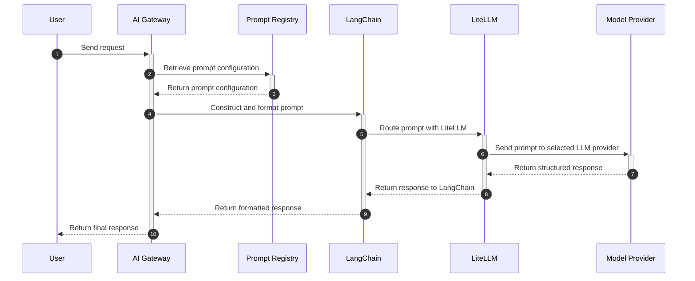

# AI Gateway Prompt and Prompt Registry Documentation

## Overview

The AI Gateway Prompt and Prompt Registry components power GitLab AI feature's integration with language models (LLMs) through the AI Gateway, supporting multiple providers via LiteLLM. This document offers an extensive technical reference for configuring, managing, and extending AI Gateway's prompt interactions with various LLMs.

This documentation includes:

- Detailed explanations of AI Gateway Prompt functionality, configuration, and LiteLLM integration
- Annotated code examples for LLM API interactions
- Extensibility considerations for additional LLMs
- Specific API integration points and input/output details required by AI feature

## 1. AI Gateway Prompt Overview

### Purpose of AI Gateway Prompts

The AI Gateway Prompts serve as structured templates that allow AI feature to send LLM-based requests, such as queries or conversational messages, to various models. These prompts use configuration files (YAML) to define the specific parameters and prompt templates that structure each request.

### AI Gateway Prompt Configuration

AI Gateway Prompts are defined as `.yml` files located in `prompts/definitions/` and specify parameters for different LLMs. Each configuration file includes:

- **Model Parameters:** Specify LLM provider and configurations, including model name and parameters such as `temperature`, `top_p`, `top_k`, `max_tokens`, and `stop`
- **Prompt Templates:** Define prompt templates that support [Jinja expression](https://jinja.palletsprojects.com/en/stable/) for multiple roles such as `user` and `system`
- **Control Parameters:** Parameters such as `max_retries` and `timeout` to manage retries and session handling

### Integration with LangChain and LiteLLM

LangChain and LiteLLM enable structured prompt construction and manage LLM interactions within the AI Gateway Prompt system.

#### Process Flow

- **Prompt Definition and Configuration:**
  - Prompts are defined in YAML configuration files located in the `prompts/definitions/` directory.
  - Each prompt configuration includes model parameters, prompt templates, and control parameters.
- **Prompt Initialization:**
  - The `LocalPromptRegistry` class loads prompt definitions from the YAML files and initializes the prompts.
  - The registry uses model factories to create instances of the models specified in the prompt configurations.
- **Prompt Retrieval:**
  - When a request is made to the AI Gateway, the appropriate prompt is retrieved from the `LocalPromptRegistry` based on the prompt ID and model metadata.
  - The `Prompt` class is instantiated with the model factory, configuration, and model metadata.
- **Prompt Construction:**
  - The `Prompt` class uses Jinja to interpolate the prompt templates with the input arguments.
  - LangChain's `ChatPromptTemplate` is used to organize the messages and construct the prompt.
- **Model Invocation:**
  - The `Prompt` class builds a process chain using LangChain, which includes the prompt and the model.
  - LiteLLM handles the interactions with the LLM providers, routing the prompt to the appropriate LLM provider based on the configuration.
- **Response Handling:**
  - LiteLLM manages retries and error handling for the requests to the LLM providers.
  - The response from the LLM provider is parsed and formatted by LiteLLM and LangChain.
  - The formatted response is returned to the AI Gateway, which then sends it back to the AI feature for display to the user.

### Example Prompt Retrieval Code

```python
from langchain_community.chat_models import ChatLiteLLM
from ai_gateway.prompts import Prompt, LocalPromptRegistry
from ai_gateway.chat.agents import ReActAgent, ReActAgentInputs

# Initialize the LocalPromptRegistry with model factories and class overrides
registry = LocalPromptRegistry.from_local_yaml(
     class_overrides={
          "chat/react": ReActAgent,  # Override for chat/react prompt
          "chat/react/vertex": ReActAgent,  # Override for chat/react/vertex prompt
     },
     model_factories={
          "anthropic": lambda model, **kwargs: ChatLiteLLM(model=model, **kwargs),  # Factory for Anthropic models
          "lite_llm": lambda model, **kwargs: ChatLiteLLM(model=model, **kwargs)  # Factory for LiteLLM models
     },
     default_prompts={}
)

# Example messages to be sent to the prompt
messages = [{"role": "user", "content": "hello!"}]

# Retrieve the prompt using the registry
prompt = registry.get("chat/react")

# Invoke the prompt asynchronously
response = await prompt.ainvoke(ReActAgentInputs(messages=messages))

# Print the response
print(response)
```

### AI Gateway Prompt Configuration Reference

Each prompt configuration file in `prompts/definitions/` requires the following structure:

```yaml
name: <string>                    # Required. Unique identifier for the prompt
model:
  name: <string>                  # Required. Model identifier (e.g. "claude-3-sonnet-20240229")
  params:
     model_class_provider: litellm # Required. Provider interface
     temperature: <float>          # Optional. 0.0-1.0. Controls randomness (default: 0.7)
     top_p: <float>                # Optional. 0.0-1.0. Controls diversity (default: 1.0)
     top_k: <integer>              # Optional. Token consideration limit (default: 40)
     max_tokens: <integer>         # Optional. Maximum tokens to generate
     stop: <string[]>              # Optional. Array of stopping sequences

unit_primitives:                  # Required. Features that can use this prompt
  - duo_chat                      # For GitLab Duo chat conversations
  # Additional primitives as needed

prompt_template:                  # Required. Templates for model interaction
  system: <string>                # Optional. System-level instructions (supports Jinja2)
  user: <string>                  # Required. User message template (supports Jinja2)

params:                           # Required. Request handling parameters
  timeout: <integer>              # Optional. Maximum response time in seconds (default: 30)
  max_retries: <integer>          # Optional. Maximum retry attempts (default: 3)
```

#### Example Configuration

```yaml
name: Code review prompt
model:
  name: claude-3-sonnet-20240229
  params:
     model_class_provider: litellm
     temperature: 0.2
     max_tokens: 1024
     stop:
        - "End"
unit_primitives:
  - duo_chat
prompt_template:
  system: "You are a code review assistant. {{ context }}"
  user: "Review this code: {{ code_diff }}"
params:
  timeout: 120
  max_retries: 3
```

## 2. AI Gateway Prompt Registry Details

### What is the Prompt Registry?

The AI Gateway Prompt Registry manages AI Gateway Prompts, serving as a central hub that associates AI feature requests with specific prompt configurations based on LLM requirements. The registry supports:

- AI Gateway Prompt retrieval by ID and metadata: Prompts are fetched based on `prompt_id`, `model_metadata`, and parameters
- Compatibility with multiple LLMs: Prompt configurations are adaptable for various LLM providers

## 3. LangChain and LiteLLM Integration

### LangChain Model Classes

LangChain's model classes, such as `BaseChatModel` from `langchain_core.language_models.chat_models`, allow the AI Gateway to chain and manage message templates dynamically. While LangChain organizes the messages for AI feature's interactions, the actual interpolation of prompt templates is handled by Jinja.

### LiteLLM Usage

LiteLLM switches between LLM providers, handling:

- Routing all LLM interactions
- Retrying failed requests and managing network errors
- Enabling easy transitions between models based on model names (e.g., claude-3-5-sonnet-20240620 for Anthropic, codellama_13b_code for Code Llama)

#### Dynamic Model Switching

Dynamic switching happens as follows:

- **Model Fetching:** The model is fetched either from request parameters (`model_name`, `identifier`, `endpoint`, `api_key`), or if the parameters are not available, from the prompt definition found in `my/feature/base.yaml`.
- **Parameters:**
  - `model_name`: A name of a group of models that share the same prompt.
  - `identifier`: General name given to the model in the format provider/model_name, where provider is optional.
  - `endpoint`: Ignored for Bedrock, but for providers that provide simple API key authentication, it's the endpoint the model should hit.
  - `api_key`: Key used to authenticate against the API.

## 4. Current Implementations

### Integration with LLMs in AI feature

#### Input and Output Details

- **Inputs:** `PromptRequest` objects contain structured fields like `inputs`, `model_metadata`, and optional settings for `stream`
- **Outputs:** JSON-formatted responses from LLM APIs, parsed and delivered to AI feature. Plain text responses from LLM APIs if the `stream` flag is enabled.

#### Example Usage of `PromptRequest`

```python
from ai_gateway.api.v1.prompts.invoke import PromptRequest, PromptInputs

prompt_request = PromptRequest(
     inputs=PromptInputs(root={"messages": [{"role": "user", "content": "What's up?"}]}),
     model_metadata={"model": "claude-3-sonnet@20240229"},
     stream=False
)
```

### Error Handling in AI feature

- **Retries:** Controlled by the `max_retries` parameter in LiteLLM
- **Timeouts:** Defined in prompt configurations (timeout in `.yml` files)
- **Error Types:** LiteLLM exceptions like `APIConnectionError` and `InternalServerError` handle API failures gracefully

### Sequence Diagram: AI feature - LLM Interaction Flow



## 5. Extensibility to New LLMs

To support new LLMs, modifications may include:

- **LiteLLM Updates:** New providers can be integrated if LiteLLM extends support
- **Custom LangChain Wrappers:** Building a LangChain wrapper for new providers would minimize changes to AI Gateway logic
- **Direct SDK Integration:** Without LiteLLM or LangChain support, direct integration with provider SDKs may be required

### Requirements for New LLM Integration

- **LiteLLM Compatibility:** Provider support within LiteLLM would allow direct usage with minimal AI Gateway changes
- **Configuration Changes:** New provider support would require specific `.yml` files with tailored parameters

### Example New Provider Prompt Configuration

```yaml
name: New Provider chat prompt
model:
  name: new-provider-large-202403
  params:
     model_class_provider: litellm
     temperature: 0.2
     top_p: 0.7
     max_tokens: 300
unit_primitives:
  - duo_chat
prompt_template:
  system: "Welcome"
  user: "What can I help with?"
params:
  timeout: 60
  max_retries: 5
  stop:
     - "End"
```

## 6. API Contracts

### AI Gateway's v1/prompts/<id> API Contracts

The AI Gateway's `v1/prompts/<id>` API allows for the retrieval and invocation of prompts based on their ID

The API contract includes:

- **Endpoint:** `GET /v1/prompts/<id>`
- **Parameters:**
  - `id`: The unique identifier of the prompt
- **Response:** JSON object containing the prompt details and configuration

### AI Gateway Prompt's API Contracts

The AI Gateway Prompt's API contracts define the keyword syntax of config files and the `Prompt` class. Key elements include:

- **Configuration Files:** YAML files specifying model parameters, prompt templates, and control parameters
- **Prompt Class:** Handles the initialization, construction, and invocation of prompts

### LangChain's API Contracts

LangChain's API contracts used by AI Gateway Prompt include:

- **ChatPromptTemplate:** Organizes messages and constructs prompts
- **BaseChatModel:** Manages message templates dynamically

For more details, refer to the [LangChain documentation](https://python.langchain.com/docs/).

### LiteLLM's API Contracts

LiteLLM's API contracts used by AI Gateway Prompt's LangChain integration include:

- **Model Factories:** Create instances of models based on configuration
- **Request Handling:** Manages retries, error handling, and routing of requests to LLM providers

For more details, refer to the [LiteLLM documentation](https://docs.litellm.ai/docs/#litellm-python-sdk).

### Anthropic API Contracts

Anthropic API contracts used by AI Gateway Prompt's LiteLLM integration include:

- **Model Parameters:** Specify model configurations such as `temperature`, `top_p`, `max_tokens`, and `stop`
- **Request Handling:** Manages the flow of requests and responses between AI Gateway and Anthropic models

For more details, refer to the [Anthropic API documentation](https://docs.anthropic.com/).

## 7. Duo Chat Integration with Anthropic

...

## Appendices

### Testing and Validation

Unit tests validate prompt configurations and LLM interactions, with mock API responses simulating AI feature use cases. For detailed test implementations, refer to:

- [tests/chat/test_agent_react.py](../tests/chat/test_agent_react.py)
- [tests/API/v2/test_v2_chat_agent.py](../tests/api/v2/test_v2_chat_agent.py)

For more details, please review the AI Gateway Prompt definitions:

- [AI Gateway Prompt Directory](../ai_gateway/prompts/definitions)
