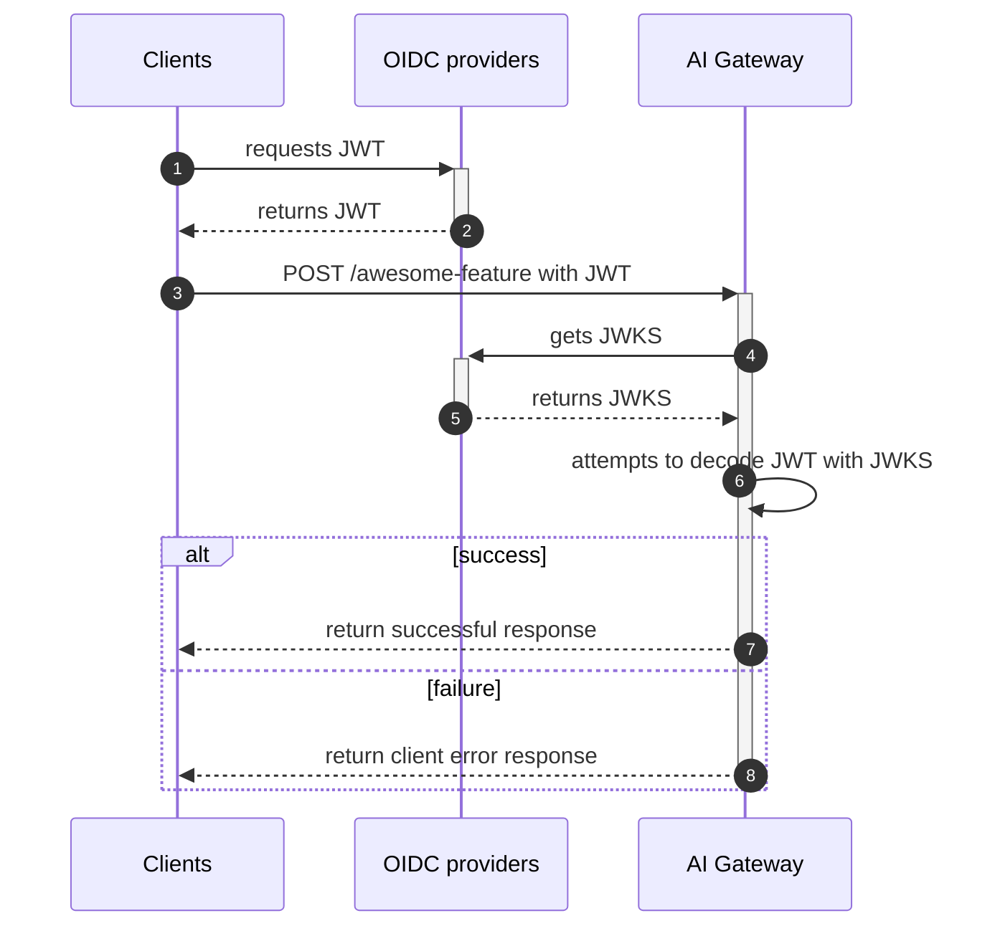

# Authentication and Authorization

## Authentication in AI Gateway

AI Gateway uses OIDC (OpenID Connect) for authenticating incoming requests. Here is an overview of the process:



Participants:

- Clients ... VS Code extension, Language server and GitLab-Rails (e.g. `VertexAI::Client`).
- OIDC providers ... Multi-tenant SaaS GitLab (`gitlab.com`) and Customer Dot (`customers.gitlab.com`).
- AI Gateway ... GitLab-managed service to provide AI related features (`cloud.gitlab.com/ai`).

Process flow:

1. A client requests to an OIDC provider to issue a JWT (JSON Web Token).
1. The OIDC provider authenticates the request and returns JWT.
1. The client requests to the AI Gateway to access a feature with the JWT.
1. AI Gateway attempts to decode the JWT with JWKS provided by trusted OIDC providers.
   These JWKS are cached in AI Gateway so that it doesn't need to request to OIDC providers every time.
1. Same
1. Same
1. If AI Gateway successfully decodes the JWT, the client request is authenticated and passed to the feature endpoints (e.g. `POST /v1/chat/agent`).
   For further authorization process, see [authorization in AI Gateway](#authentication-in-ai-gateway).
1. If AI Gateway fails to decode the JWT, AI Gateway returns an error response to the client, which could happen in the following cases:
   - The client got an JWT from an OIDC provider that is not trusted by AI Gateway.
   - The client didn't include an JWT in the `Authorization` HTTP header e.g. `Authorization: Bearer <JWT>`.
   - The value of `X-Gitlab-Authentication-Type` HTTP header is not `oidc`.
   - The value of `X-Gitlab-Realm` HTTP header and the value of `gitlab_realm` JWT claim do not match.
   - The value of `X-Gitlab-Instance-Id` HTTP header and the value of `subject` JWT claim do not match.

Notes:

- Authentication happens in a middleware named `MiddlewareAuthentication`.
  This middelware is processed for all incoming requests before passing them to feature endpoints.
- There is a case that a client and an OIDC provider co-exist in the same server.
  For example, an OIDC provider as multi-tenant SaaS GitLab and a client as GitLab-Rails co-exist in `gitlab.com`.

### OIDC providers

The endpoint `/.well-known/openid-configuration` is to get the JWKS URI. We then
call this URI to fetch the JWKS. We cache the JWKS for 24 hours and use it to validate
the authenticity of the suggestion requests.

### Configure OIDC providers in AI Gateway

To test OIDC, set the following in `.env`:

```shell
# To test multi-tenant SaaS GitLab instance as OIDC provider
# i.e. set `GITLAB_SIMULATE_SAAS=1` in your GDK.
AIGW_GITLAB_URL=http://<your-gdk-address>/    # e.g. http://gdk.test:3000/

# To test CustomersDot as OIDC provider
AIGW_CUSTOMER_PORTAL_URL=http://<your-customer-dot-address> # e.g. http://127.0.0.1:5000
```

See [Test AI features with AI Gateway locally](https://docs.gitlab.com/ee/development/ai_features/index.html) for more information.

### Bypass authentication and authorization for testing features

If you want to quickly test features in GDK,
you can disable the auth logic by changing the following application setting in `.env`:

```shell
AIGW_AUTH__BYPASS_EXTERNAL=true
```

## JWK Signing Key and Validation Key

The JWK signing key is used to sign User JWTs when requested by a GitLab instance.
The validation key is a secondary key used purely for token validation whenever the signing key expires or is rotated.
This ensures we always have a key in place to sign and validate tokens.

### JWK signing key rotation

The `AIGW_SELF_SIGNED_JWT__SIGNING_KEY` and `AIGW_SELF_SIGNED_JWT__VALIDATION_KEY` private keys should be rotated yearly.
There is an issue created to remind us of this: <https://gitlab.com/gitlab-org/modelops/applied-ml/code-suggestions/ai-assist/-/issues/514>.

#### Keep already issued tokens valid during the key rotation

Once we rotate the `AIGW_SELF_SIGNED_JWT__SIGNING_KEY`, already issued JWT tokens would stop being valid immediately.
In order to continue supporting already issued JWT tokens for up to the intended lifetime, we introduced the `AIGW_SELF_SIGNED_JWT__VALIDATION_KEY`.

During the rotation of `AIGW_SELF_SIGNED_JWT__SIGNING_KEY`, `AIGW_SELF_SIGNED_JWT__VALIDATION_KEY` will contain the value of the old `AIGW_SELF_SIGNED_JWT__SIGNING_KEY`.
New tokens will be issued with a new value for `AIGW_SELF_SIGNED_JWT__SIGNING_KEY`.
The AI Gateway has both keys in the JWKS, so it is able to decode tokens with either of the keys.

#### Steps to rotate the key

Since we have to update values in the Vault, and the keys are sensitive data, certain steps have to be done by a security engineer. These steps are labeled with (Security).

1. (Security) Update the `AIGW_SELF_SIGNED_JWT__VALIDATION_KEY` environment variable in the [vault](https://vault.gitlab.net/ui/vault/secrets/runway/kv/list/env/production/service/ai-gateway/) with the current `AIGW_SELF_SIGNED_JWT__SIGNING_KEY` value.
1. (Security) Update the value `AIGW_SELF_SIGNED_JWT__SIGNING_KEY` in the vault with a new key. A new key can be generated by the following command: `openssl genrsa -out jwt_signing.key 2048`
1. Create a Slack reminder in `#g_ai_framework` to be triggered after 3 days of updating the initial keys, to update the `AIGW_SELF_SIGNED_JWT__VALIDATION_KEY` value ([Example](https://gitlab.com/gitlab-org/modelops/applied-ml/code-suggestions/ai-assist/-/issues/514#note_1958167234))
1. Create a new issue as a reminder to rotate the JWK Signing Key with a due date 1 month before the rotation schedule ([Example](https://gitlab.com/gitlab-org/modelops/applied-ml/code-suggestions/ai-assist/-/issues/514))
1. Create a Slack reminder in `#g_ai_framework` to be triggered 1 month before the next rotation schedule
1. (Security) Update the value of `AIGW_SELF_SIGNED_JWT__VALIDATION_KEY` from the vault to a new key. A new key can be generated by the following command: `openssl genrsa -out jwt_validation.key 2048`

## Authorization in AI Gateway

AI Gateway uses `scopes` custom claim in JWT to check user permissions, which was decoded in [the previous authentication process](#authentication-in-ai-gateway).

For example, if a decoded token contains the following `scopes`, the user can access to `code_suggestions` and `duo_chat` features:

```json
{
    scopes: [
        'code_suggestions',
        'duo_chat'
    ],
    // ... and the other claims, such as `aud`, `sub`, etc.
}
```

Notes:

- Available feature names are listed in [`GitLabUnitPrimitive`](https://gitlab.com/gitlab-org/modelops/applied-ml/code-suggestions/ai-assist/-/blob/main/ai_gateway/gitlab_features.py).

### Get current user and check permission

You can get a currently authenticated user and check if the user has permission to access a specific feature.
This is useful to granularly switch the business logic per user permissions. Example:

```python
from ai_gateway.api.auth_utils import get_current_user, StarletteUser


@router.post("/awesome_feature")
async def awesome_feature(
        request: Request,
        current_user: Annotated[StarletteUser, Depends(get_current_user)]
):
    if current_user.can(GitLabUnitPrimitive.AWESOME_FEATURE_1):
    # Do X
    elif:
        current_user.can(GitLabUnitPrimitive.AWESOME_FEATURE_2):
    # Do Y
    else:
        raise HTTPException(
            status_code=status.HTTP_403_FORBIDDEN,
            detail=f"Unauthorized to access awesome feature",
        )
```

### Use `x-gitlab-unit-primitive` header

As an alternative approach to the [fine-grained authorization](#get-current-user-and-check-permission),
you can also enable authorization on a specific endpoint with `authorize_with_unit_primitive_header`.
This decorator reads the `x-gitlab-unit-primitive` header from requests and
checks if the user has permission to access the unit primitive. Example:

```python
from ai_gateway.api.v1.proxy.request import authorize_with_unit_primitive_header


@router.post("/awesome_feature")
@authorize_with_unit_primitive_header()
async def awesome_feature(
        request: Request,
):
# Do something
```

This decorator also validates that the request is not modified at client side.
If a client attempts to use a unit primitive for a different purpose,
the request is flagged as an abused request, which reported to
the `abuse_request_probabilities` Prometheus metric and `abuse_detection` log.
For such requests, GitLab may conduct further investigation and 
block the requests in Cloud Connector LB or AI Gateway middleware.
See [this issue](https://gitlab.com/gitlab-com/legal-and-compliance/-/issues/2176) (Internal Only) for more information.
