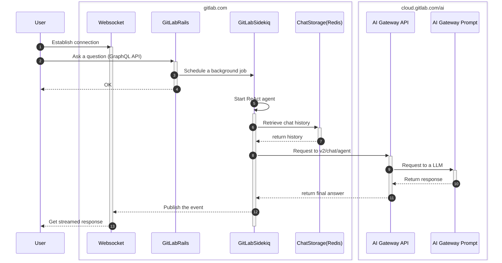
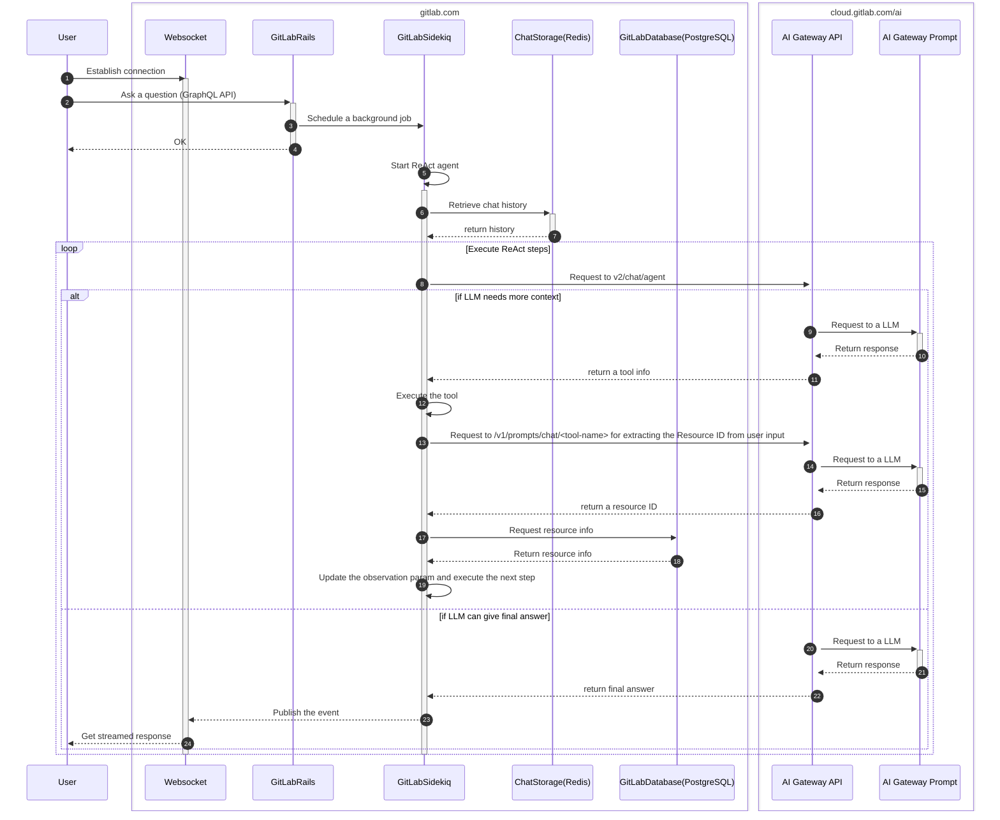

# GitLab Duo Chat

This page explains the functionalities existing in AI Gateway for GitLab Duo Chat features.

## Process Flow

The following diagram illustrates the minimal process flow that is required to answer an essential user input (e.g. `Hello`):

### Detailed process flow

The following diagram illustrates more complicated process flow that is required to answer a real-world user input (e.g. `Summarize this issue`):

## AI Gateway APIs

The following endpoints are used by GitLab Duo Chat:

- `v2/chat/agent` ... ReAct execution endpoint. This endpoint constructs a prompt with the tool definitions and request to LLM through [AI Gateway Prompt](./aigw_prompt_registry.md).
  - [AI Gateway Prompt configuration files](https://gitlab.com/gitlab-org/modelops/applied-ml/code-suggestions/ai-assist/-/tree/main/ai_gateway/prompts/definitions/chat/react?ref_type=heads)
- `/v1/prompts/chat/*` ... Slash commands and tool execution endpoints. See [AI Gateway Prompt](./aigw_prompt_registry.md) for more information.
  - [AI Gateway Prompt configuration files](https://gitlab.com/gitlab-org/modelops/applied-ml/code-suggestions/ai-assist/-/tree/main/ai_gateway/prompts/definitions/chat?ref_type=heads)

Visit `http://0.0.0.0:5052/docs` for the latest API interface of the Duo Chat endpoints.
